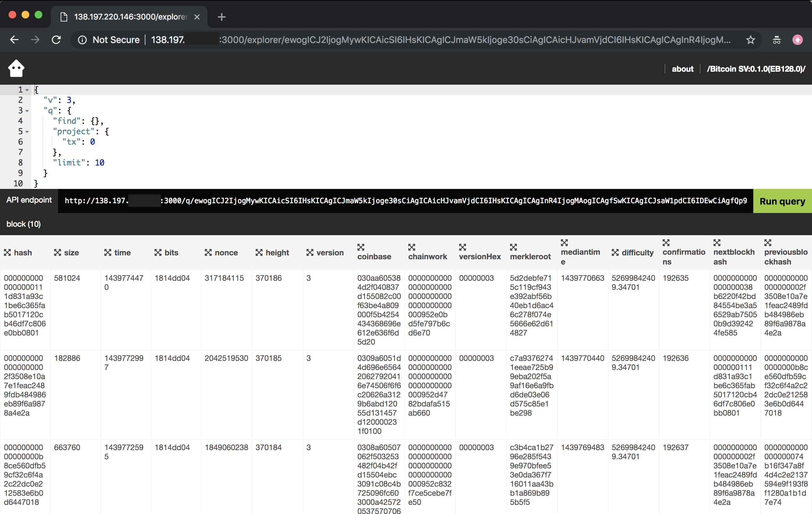

# Run a Planaria Node

## 1. Install

Before we get started, there are a couple of things we need to install.

### A. Install Docker

<div class='center'>

</div>

If you don't have docker installed on your computer, you can follow the instructions here:  https://docs.docker.com/install/#supported-platforms

### B. Install Docker-compose

<div class='center'>

</div>

You also need to install docker compose. Docker compose lets you manage multiple docker containers easily. Planaria runs on two core containers:

1. **Planaria:** Crawler + indexer
2. **Planarium:** Query processor + HTTP endpoint

So we need docker-compose to manage them. Follow the instruction here to install: https://docs.docker.com/compose/install/

### C. Install Planaria Computer

<div class='center'>

</div>

Finally, install **Planaria Computer**. This tool does all the heavy lifting of generating, deploying, and managing planaria state machines.

```
npm install -g planaria
```

## 2. Create a New Machine

Let's create a new state machine.

```
pc new machine
```

This will walk you through a quick questionnaire and generate a project scaffold.

[Gif]


## 3. Start the Machine

When you create a new machine, by default it generates a [Genesis BitDB](https://medium.com/@_unwriter/genesis-a25b121e0575).

We can customize this later in the tutorial but for now lets just run the default.

```
pc start
```

You will be asked whether to join the Planaria network or not. You can say "No" if you want to run privately. The default is "Yes" (The whole point of Planaria is **transparent swarm computing**, which means all backends should be transparent and reproduceable, so being public is important)

You will see two containers starting up:

1. **Planaria:** The core crawler and indexer
2. **Planarium:** The HTTP + SSE (Server Sent Events) API endpoint for interacting with Planaria.

[GIF]

You can check the log with

## 4. Use the Machine

Now we're all ready! Let's open up the browser and check.

[gif]

If you click the "query" button, you'll be sent to a Planarium explorer



If you click the "socket" buttono, you'll be sent to a Bitsocket explorer

[socket image]

## 5. Program your State Machine

Now that we've seen the default machine in action, let's try building our custom machine.

See [Programming Planaria]() for details.

## 6. Deploy the Machine to Planaria Network

As mentioned, Planaria is ALL about transparecy.

Unlike traditional clouds, a service based on Bitcoin MUST be 100% open and transparent. Otherwise your users won't be able to trust you.

This is why the main design principle of Planaria is **Transparency**.

The entire state machine can be programmed with a single JavaScript file, and you can publicly post it to the repository to share with the world, so your users will know which code is running in the backend.

To deploy to the planaria network registry, go into your `genes/[Address]` folder where all your files are, and:

```
pc push
```

## 7. Run an Existing Planaria Machine

Once a Planaria machine is stored on the [Planaria Network](https://planaria.network/), anyone can easily pull and run it.

All you need to do is:

```
pc pull [Address]
```

You can find the planaria Address at the top of every planaria page

[image. screenshot]

Such ease of deploying and running someone else's machine is critical. It means 100% portable backend that will NEVER go away. By "never go away" I mean:

1. Even if the last person running the machine shuts it down, it's still not dead. Someone can pull the code 100 years from now and run it, and it will recreate the entire state by crawling the Bitcoin blockchain.
2. Even if one node goes down, if there are other nodes running on the same transparent planaria code, the API consumers can easily migrate to this new node.
