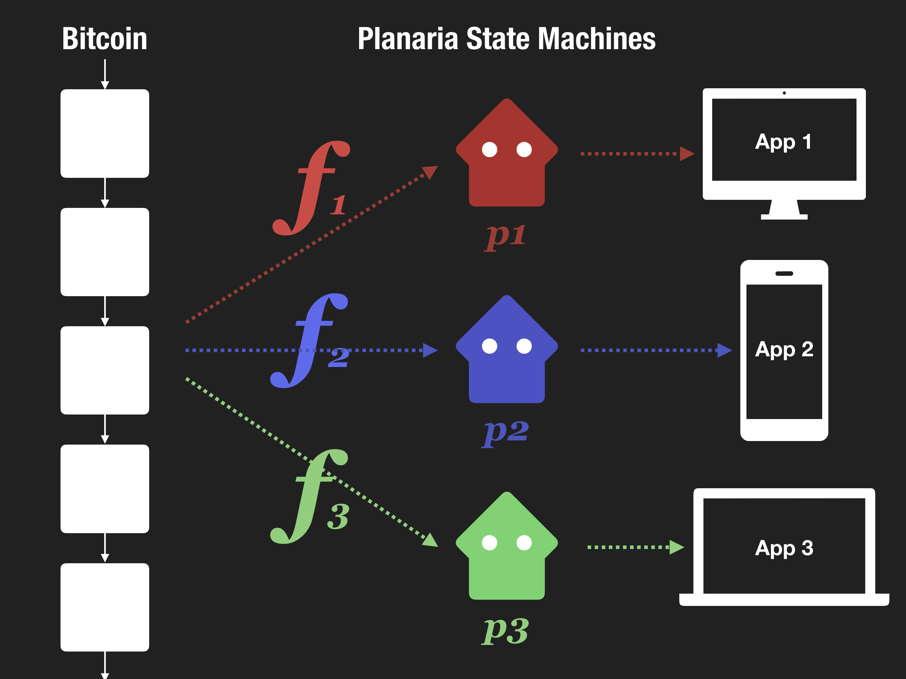
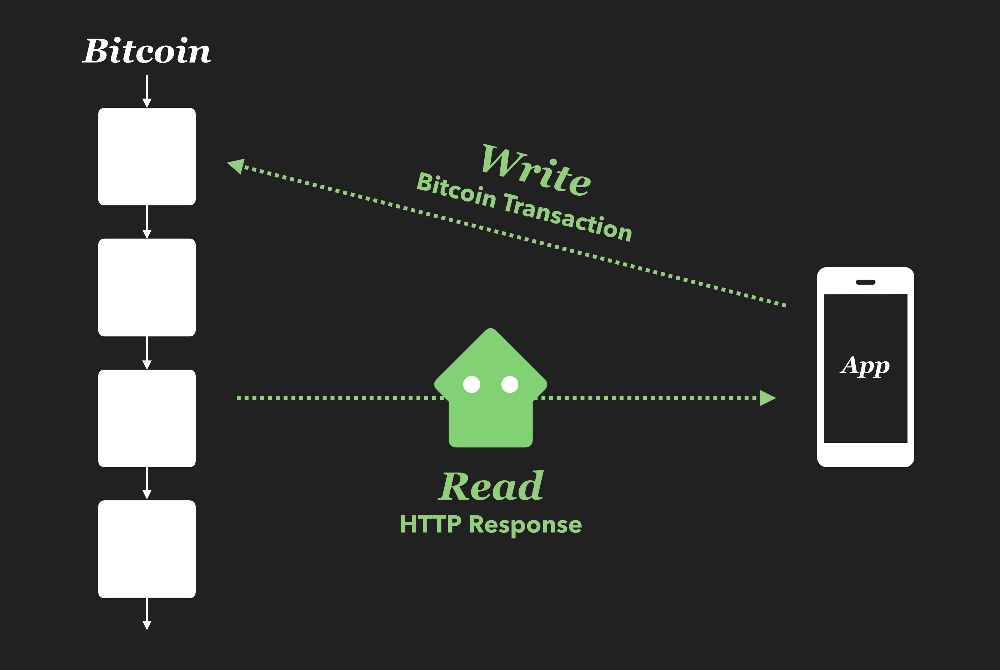

# Planaria

Infinite State Machine over Bitcoin


# Intro

To understand Planaria, let's first set the context:

1. What is Bitcoin?
2. What is a Machine?
3. What is a State Machine?


## 1. What is Bitcoin?

Let's think of Bitcoin as a perpetual rotating machine, an infinity motor.


Each rotation is a Bitcoin block, and Bitcoin's job is to collect all the events (transactions) that happen through each rotation and take an immutable snapshot (a block). The rotation logic (Bitcoin's consensus model) is deterministic, making it a stable piece of technology to power all kinds of useful machines. 

- **Perpetual:** Because it's a circle, it rotates forever as long as there's fuel (Miner + User incentives)
- **Deterministic:** Because the way it works is deterministic, it can be trusted enough to be used as the "motor" to power any machine, just like how the determinism of a real world motor makes it the building block for every single electric device out there.
- **Minimal:** Because of its minimalism, Bitcoin can plug into ANYTHING to power anything, making it the most versatile piece of technology. Just like the real world motor.


## 2. What is a Machine?

Now that we've set the context for:

```
Bitcoin == Motor
```

We can think about how to build a machine with a motor (Bitcoin). But first, what exactly is a **"machine"**?

A machine is a **function**. A machine takes a motor as the constant source of energy and **transforms the energy into various forms that can be consumed by humans**. Every single machine we can imagine is powered by a motor (Car, blender, electric fan, vacuum cleaner, toys, etc.).

```
Machine = f(Motor)
```


- **Motor:** The only thing from above three graphs is **the constant rotation** of the "motors" on the left side. That's Bitcoin. It's minimal, deterministic, and infinite.
- **Machine:** Each graph has a different "function" (circle, square, and hexagon) which transforms the motor energy into different forms. In this abstract diagram it's represented as a waveform, but in reality these will be actual products such as electric scooter, air conditioner, vacuum cleaner, etc.


## 3. What is a State Machine?

So far everything sounds abstract. Now let's look into how this will be implemented in a more concrete manner.

Since we will be building a software (not a real physical machine), we will be building what's called a **"state machine"**.

Most computer applications (web app, mobile app, desktop app, or whatever) are implementations of a state machine, so a good way to understand how applications work is understanding what a "state machine" is.

> It is an [abstract machine](https://en.wikipedia.org/wiki/Abstract_machine) that can change from one state to another in response to some external [inputs](https://en.wikipedia.org/wiki/Input_(computer_science)); the change from one state to another is called a *transition*. A state machine is defined by a list of its states, its initial state, and the conditions for each transition.


Mario is a "finite" state machine. 

1. **State:** Mario has 4 finite states: "Mario", "Fire Mario", "Super Mario", and "Cape Mario". 
2. **Input:** It receives external input in the form of items (mushroom, feather, and flower)
3. **Transition:** The game has a state transition algorithm. When Mario eats a mushroom he transitions into Super Mario.

Every application is a state machine. They keep some sort of state somewhere (database), transition the state (application controller logic) and present the up-to-date to the user based on user interaction (input).

## 4. What is an Infinite State Machine?

It simply means 


# What is Planaria?

In the most basic form, Planaria lets you create your own custom state machine powered by Bitcoin. 

## 1. Planaria is a Bitcoin-powered backend

To be more straightforward, you can build real world web applications, mobile applications, etc., all powered by Bitcoin. The best part is, it doesn't require any esoteric useless knowledge, or even require a grand setup. The philosophy is exactly the same as Bitcoin itself: Stay minimal.

All you need to do is write a **transition function** (represented as f1, f2, f3 below), and you will end up with various types of state machines you can use just like a regular HTTP backend.



These state machines will look just like a regular HTTP API, except that every event and database update is driven by Bitcoin transactions. 

## 2. Comparison with the "Cloud" model

Let's briefly look at the difference between the traditional cloud model and Planaria's Bitcoin powered model.

In a cloud model,

1. Users interact with the cloud through HTTP.
2. Both "Read" and "Write" interactions are done through HTTP requests.
3. The data is stored on a central cloud, and the application provider is the gateway to this data repostiory.
4. Authentication is also carried out on the cloud side. User credentials are also stored on the cloud.


With Planaria,

1. Instead of a centralized cloud server, everything is stored on the Bitcoin blockchain
2. Each planaria node acts as a filter, storing data in a format that's more application specific and easily queryable.
3. Users "Write" by making Bitcoin transactions.
4. Users "read" by connecting to planaria nodes for easy HTTP access.
5. Authentication is built into the architecture because every write action is powered by a signed Bitcoin transaction. 




## 3. Planaria is Immortal

**Anyone with a Bitcoin node and a transition function should be able to reproduce the corresponding planaria node.**

If you have f1, f2, f3, you should be able to reproduce p1, p2, p3 nodes respectively.

And you can design the gene (The transition functions) in a way that every planaria instance is exactly identical.

In fact, let's revisit the "wave generating motor" again, because this is exactly how it works:


The circle, square, and the hexagon are the transition functions, which will eternally generate the same wave forms they are generating right now, as long as the rotating motor they share (Bitcoin) works the same.

What does this mean in reality?

1. You build a Bitcoin application using Planaria.
2. Transparency: You publish your state machine publicly for transparency. Other users can verify themselves that your machine is working as advertised.
3. 

Let's say you created a Bitcoin application today powered by Planaria. You publish the gene the state machine for transparency. But after a while you decide that you don't want to run it anymore. In most cases, this will mean


